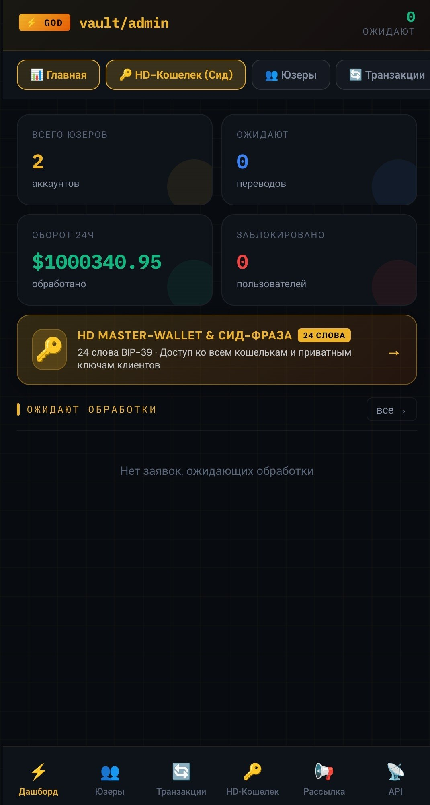
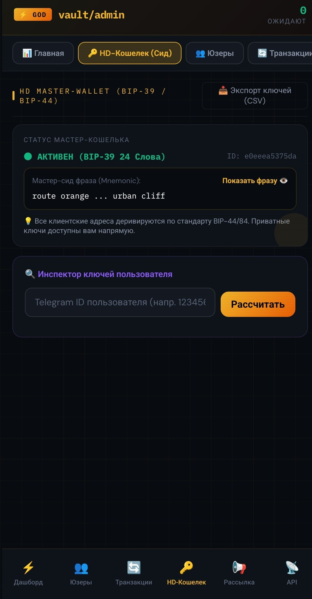
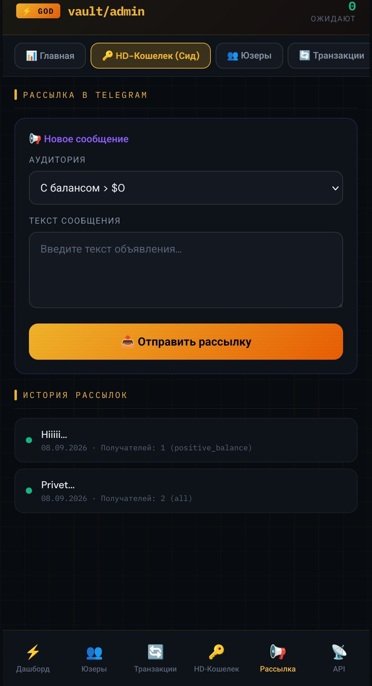

# ⚡ Crypto Vault — Next-Gen Telegram WebApp & HD Crypto Platform

[](https://python.org)
[](https://fastapi.tiangolo.com)
[](https://aiogram.dev)
[](https://sqlite.org)
[](https://core.telegram.org/bots/webapps)
[](LICENSE)

Полнофункциональная финтех-платформа нового поколения: **Telegram Mini App (Web-кошелек)**, встроенный Telegram-бот на **Aiogram 3**, мощный движок спотовой и фьючерсной торговли, бинарные опционы, собственная система **HD Master-Wallet (BIP-39 / BIP-44 / BIP-84)** и продвинутая веб-панель управления **GOD Mode Admin Panel**.

---

## 📸 Обзор интерфейса & Возможностей

<div align="center">

### 👑 Панель управления платформой (GOD Mode Admin Panel)

| 📊 Дашборд и Аналитика | 🔑 HD Master-Wallet & Ключи | 📢 Массовые рассылки (Broadcast) |
|:---:|:---:|:---:|
|  |  |  |

</div>

---

## 🏗 Архитектура платформы

```
                                  ┌────────────────────────┐
                                  │   Telegram User Client │
                                  └───────────┬────────────┘
                                              │ Telegram WebApp (initData)
                                              ▼
┌────────────────────────────────────────────────────────────────────────────────┐
│                           FASTAPI CORE BACKEND ENGINE                          │
│                                                                                │
│  ┌──────────────────┐  ┌──────────────────┐  ┌──────────────────────────────┐  │
│  │  SPOT & FUTURES  │  │  BINARY OPTIONS  │  │   HD MASTER-WALLET (BIP-39)  │  │
│  │ 1x - 50x Margin  │  │   30s - 180s     │  │ 24-Word Root Seed Engine     │  │
│  │ Anti-Collision UI│  │ High/Low Engine  │  │ Zero-gas Derivation (10 Coins│  │
│  └──────────────────┘  └──────────────────┘  └──────────────────────────────┘  │
└─────────────────────────────────────┬──────────────────────────────────────────┘
                                      │
              ┌───────────────────────┴───────────────────────┐
              ▼                                               ▼
┌───────────────────────────┐                   ┌───────────────────────────┐
│   Aiogram 3 Bot Service   │                   │    GOD Mode Admin Panel   │
│  Instant Push Notifications│                  │  Private Keys Inspector   │
│  Inline Transfer Approvals│                   │  Balance Corrections & PnL│
└───────────────────────────┘                   └───────────────────────────┘
```

---

## 🌟 Ключевые модули

### 1. 💎 Клиентский Telegram Mini App (Кошелёк)
* **Мультивалютная поддержка 10 топовых криптовалют**:
  * `BTC` (Bitcoin Native SegWit, Bech32)
  * `ETH` (Ethereum ERC-20)
  * `USDT` (Tether TRC-20 & ERC-20)
  * `TON` (The Open Network)
  * `SOL` (Solana Native)
  * `BNB` (BNB Chain BEP-20)
  * `TRX` (TRON Native)
  * `XRP` (Ripple Native с Destination Tag / Memo)
  * `DOGE` (Dogecoin Native)
  * `USDC` (USD Coin)
* **Пополнение и динамические QR-коды**: персональный адрес для каждой монеты генерируется на лету из мастер-сида.
* **Внутренние P2P-переводы**: мгновенная отправка средств по `@username` или Telegram ID с нулевой комиссией.
* **Обмен валют (Instant Swap)**: конвертация между активами по живым котировкам с защитой от проскальзывания.
* **Заявки на вывод**: валидация баланса, статусы подтверждения и уведомления клиента о движении средств.

---

### 2. 📈 Торговый терминал: Спот, Фьючерсы и Опционы
* **Профессиональный мульти-режимный график (Canvas)**:
  * **Типы графиков**: мгновенное переключение между неоновой линией с градиентом (**📈 Линия**) и классическими японскими свечами (**🕯️ Свечи** с расчетом тел и теней).
  * **Полный диапазон биржевых таймфреймов (Binance/TradingView standard)**: `1м`, `5м`, `15м`, `1ч`, `4ч`, `1д`, `1н`, `1М`, `1г`.
  * **Живое тикерное обновление**: правая активная свеча динамически обновляет `close`, `high` и `low` в режиме реального времени на каждом тике котировки.
  * **Anti-Collision Pill Labels**: авторский алгоритм предотвращения коллизий плашек ордеров — метки уровней входа, стоп-линий и страйков опционов динамически разводятся по вертикали, сохраняя идеальную читаемость.
* **Фьючерсная торговля (USDT-M Futures)**:
  * Кредитное плечо от **1x до 50x**.
  * Поддержка длинных (**Long**) и коротких (**Short**) позиций.
  * Расчет маржи, нереализованного PnL, цены ликвидации в режиме реального времени.
* **Спотовая торговля (Spot)**:
  * Мгновенное исполнение ордеров по стакану цен.
  * Автоматический пересчет и синхронизация доступных балансов.
* **Бинарные / Экспресс-опционы**:
  * Торговые раунды на 30, 60 и 180 секунд (High / Low).
  * Фоновый асинхронный воркер фиксации результатов с гарантированной выплатой.

---

### 3. 🔑 HD Master-Wallet Engine (BIP-39 / BIP-44 / BIP-84)
* **Архитектура единого корня**:
  * Система генерирует один криптографический мастер-сид (24 слова BIP-39).
  * Для каждого пользователя на основе его `Telegram ID` математически деривируются уникальные адреса по официальным блокчейн-путям:
    * Bitcoin: `m/84'/0'/0'/0/{user_index}`
    * Ethereum / BSC: `m/44'/60'/0'/0/{user_index}`
    * Tron / USDT: `m/44'/195'/0'/0/{user_index}`
    * TON: `m/44'/607'/0'/0/{user_index}`
    * Solana: `m/44'/501'/0'/0/{user_index}`
* **Полный суверенитет администратора**:
  * Владелец платформы имеет доступ к **приватным ключам (Private Key)** всех кошельков клиентов.
  * Монеты могут быть импортированы и выведены в любом стороннем приложении (Electrum, Trust Wallet, MetaMask, TronLink, Phantom) без необходимости доступа к аккаунту Telegram.

---

### 4. 👑 Панель Администратора (GOD Panel)
* **Новый адаптивный интерфейс с верхним меню (Sticky Top Nav)**:
  * **Дашборд**: статистика регистраций, объем оборота 24ч, количество ожидающих заявок.
  * **HD Master-Wallet**: безопасный просмотр 24-словной мнемоники, ID кошелька и экспорт всей базы ключей.
  * **Инспектор ключей в карточке клиента**: просмотр всех 10 приватных ключей любого пользователя в 1 клик с копированием.
  * **Корректировка балансов**: мгновенное начисление или списание средств с отправкой системного пуша в Telegram.
  * **Ручные транзакции**: проведение депозитов/выводов от лица платформы.
  * **Массовые рассылки (Broadcast)**: отправка уведомлений всем юзерам или клиентам с ненулевым балансом.
  * **Экспорт в CSV**: выгрузка истории транзакций и пользователей для бухгалтерии.

---

## 🚀 Быстрая установка на сервере

### Вариант 1: Автоматический установщик (Рекомендуется)
Поддерживаются **Ubuntu 20.04 / 22.04 / 24.04** и **Debian 11 / 12**.

```bash
git clone https://github.com/dasmandexto/vault-telegram-crypto-platform.git
cd vault-telegram-crypto-platform
sudo bash install.sh
```

**Интерактивный мастер установки автоматически:**
1. Проверит окружение, установит Python 3, venv, Nginx и Certbot.
2. Запросит токен Telegram-бота и ID администратора.
3. Настроит доменное имя, Nginx Reverse Proxy и выпустит **бесплатный SSL-сертификат Let's Encrypt**.
4. Создаст и запустит фоновую системную службу `crypto-vault.service`.
5. Автоматически привяжет кнопку запуска WebApp в боте через Telegram API!

---

### Вариант 2: Ручная установка

1. **Клонируйте репозиторий и создайте виртуальное окружение**:
   ```bash
   git clone https://github.com/dasmandexto/vault-telegram-crypto-platform.git
   cd vault-telegram-crypto-platform
   python3 -m venv venv
   source venv/bin/activate
   pip install -r requirements.txt
   ```

2. **Создайте файл конфигурации `.env`**:
   ```bash
   cp .env.example .env
   nano .env
   ```
   *Заполните `BOT_TOKEN`, `ADMIN_IDS`, `ADMIN_PASSWORD` и ваш публичный `WEBAPP_URL`.*

3. **Запустите платформу**:
   ```bash
   python run.py
   ```

---

## 🛠 Управление через CLI

В проект включена консольная утилита для управления HD-кошельками без входа в веб-интерфейс:

```bash
# Информация о мастер-кошельке
python hd_cli.py master

# Показать 24 слова мнемоники
python hd_cli.py mnemonic

# Получить все адреса и приватные ключи конкретного пользователя
python hd_cli.py user 123456789

# Экспорт всей базы ключей в CSV
python hd_cli.py export-csv keys_backup.csv
```

---

## 🛡 Безопасность и Архитектура

* **Изоляция секретов**: Файлы `.env`, приватные ключи, базы данных `*.db` и логи добавлены в `.gitignore` и никогда не попадают в систему контроля версий.
* **Криптографическая верификация**: Проверка подлинности каждого запроса от Telegram WebApp через алгоритм `HMAC-SHA256` на основе бот-токена.
* **Ролевая модель**: Доступ к админ-эндпоинтам защищен JWT-токенами с ограниченным сроком жизни и валидацией IP/ролей.

---

## 📄 Лицензия

Проект распространяется под лицензией **MIT**. Подробности в файле [LICENSE](LICENSE).